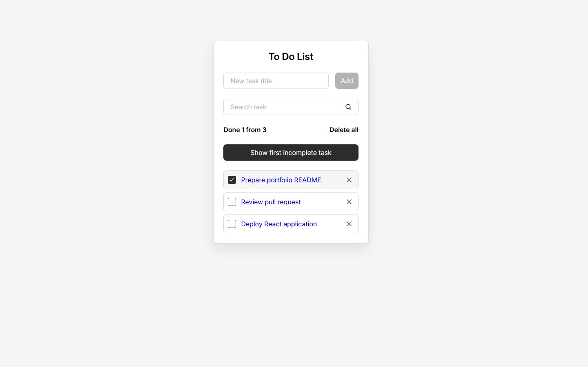
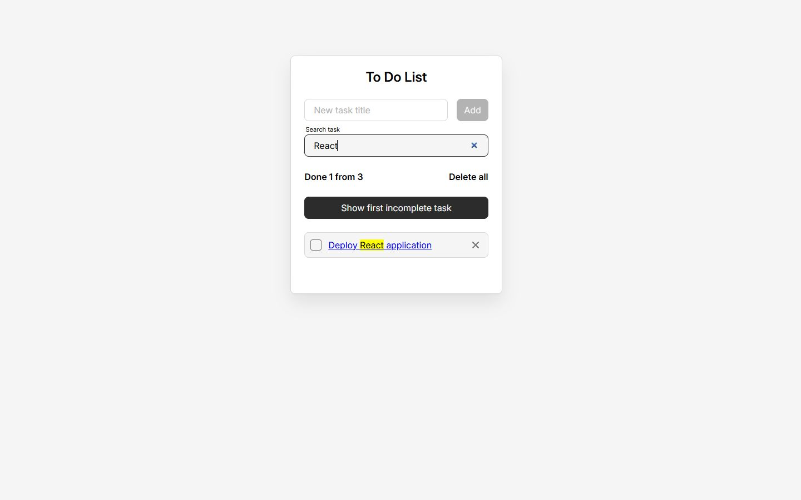

# Todo React

A course-based task manager built to practise modern React fundamentals in a complete application.

[Live demo](https://ssimchenko.github.io/todo-react/) 

## Screenshots



*Task list with completion tracking, statistics, and quick actions.*



*Task filtering with safe highlighting of the matching text.*

## What it can do

- Add, complete and delete tasks
- Search tasks with safe text highlighting
- Persist data in `localStorage`
- Open a separate details page for each task
- Show task statistics and scroll to the first incomplete item
- Animate task creation and deletion

## What I practised

- React components, props and controlled forms
- State management with `useState`, `useReducer` and Context
- Effects, refs, memoisation and custom hooks
- A small router implemented without a routing library
- A replaceable data layer for `localStorage` and `json-server`
- SCSS Modules and feature-oriented project structure
- Production builds and deployment to GitHub Pages

## Tech stack

`React 19` · `JavaScript` · `Vite` · `SCSS Modules` · `ESLint` · `json-server`

## Project structure

```text
src/
├── app/       # application setup, global styles and routing
├── pages/     # route-level screens
├── widgets/   # composed interface blocks
├── features/  # add, search and statistics features
├── entities/  # task model, hooks and UI
└── shared/    # reusable UI, API adapters and utilities
```

The structure is inspired by Feature-Sliced Design and keeps domain logic separate from reusable UI and infrastructure.

## Run locally

```bash
npm install
npm run dev
```

The production build can be checked with:

```bash
npm run build
npm run preview
```

The app uses `localStorage` by default. To practise requests against `json-server`, start `npm run server` and run Vite with `VITE_STATIC_BACKEND=false`.
